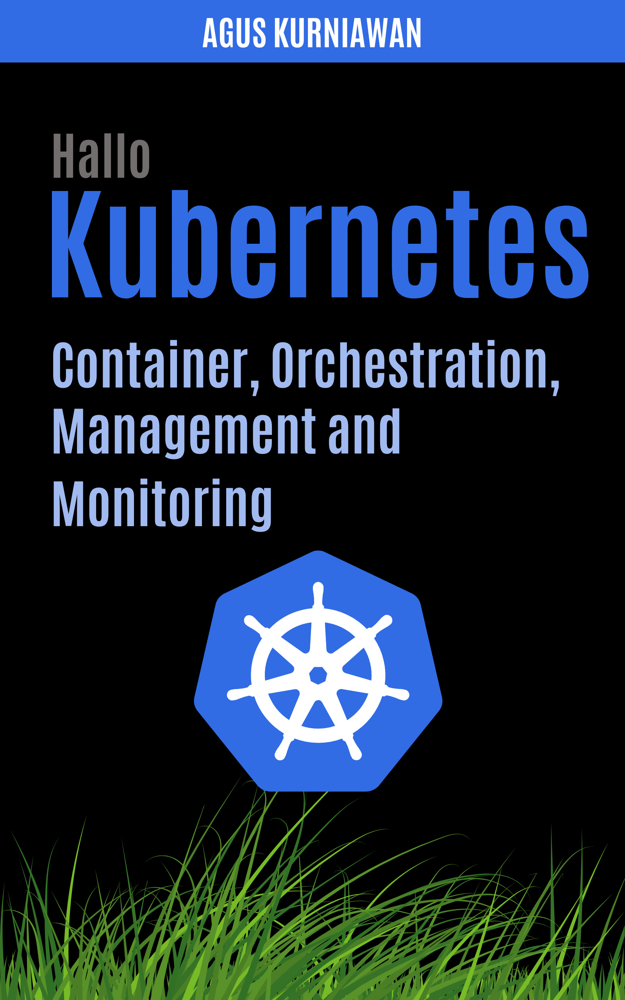

# Hallo Kubernetes: Container, Orchestration, Management, and Monitoring

Explore the dynamic world of Kubernetes from the ground up with "Hallo Kubernetes," your comprehensive guide to mastering container orchestration, management, and monitoring. This book provides an extensive look into how Kubernetes operates, coupled with detailed exercises to build, manage, and scale applications effectively using this powerful platform.

Starting with a clear introduction to what Kubernetes is and why it's a game-changer for modern software deployments, the book progresses into hands-on exercises to get you up and running. You'll learn how to install and enable Kubernetes using Docker Desktop, configure Rancher Kubernetes Engine, and manage Kubernetes clusters using various tools such as kubectl and Helm.

Each chapter is meticulously designed to enhance your understanding and skills, focusing on real-world applications of Kubernetes functionalities such as deployments, services, storage solutions, ingress networking, and even Kubernetes secrets for managing sensitive data. The exercises are structured to guide you through basic setups to more advanced configurations, ensuring you gain practical knowledge and confidence in using Kubernetes.

For those looking to dive deeper, the book covers advanced topics such as autoscaling, managing cron jobs, and deploying the Kubernetes Dashboard UI. It also offers insights into the strategic use of Kubernetes namespaces and ingress resources to optimize your container environments for both development and production.

Whether you're a beginner curious about containerization or an experienced developer aiming to leverage Kubernetes at scale, "Hallo Kubernetes" offers the knowledge and tools necessary to navigate and excel in the world of containers and orchestration. Join the ranks of skilled Kubernetes professionals with this essential guide at your side.

## Exercises

This book contains exercises to help you learn Kubernetes. You can follow the exercises in the order they are presented in the book.

* Exercise 1: Install and Enable Kubernetes using Docker Desktop
* Exercise 2: Install Rancher Kubernetes Engine (RKE) on a single node
* Exercise 3: Install kubectl client
* Exercise 4: Install Red Hat OpenShift on a single node
* Exercise 5: Accessing Kubernetes Cluster using kubectl
* Exercise 6: Basic Kubernetes CLI - kubectl
* Exercise 7: Helm
* Exercise 8: oc CLI for OpenShift
* Exercise 9: Basic Kubernetes YAML
* Exercise 10: Multiple Containers in A Kubernetes Deployment
* Exercise 11: Kubernetes ConfigMaps
* Exercise 12: Mutiple Kubernetes Deployments in Kubernetes YAML
* Exercise 13: Configure Container Resources in A Kubernetes Deployment
* Exercise 14: Basic Kubernetes Services
* Exercise 15: Deploying MySQL and phpMyAdmin
* Exercise 16: Deploying PostgreSQL and pgAdmin
* Exercise 17: Deploying NodeJS Application and MongoDB
* Exercise 18: Kubernetes Deployment and Service with Namespace
* Exercise 19: Service Autoscaling
* Exercise 20: External Name Service
* Exercise 21: Kubernetes Namespace CRUD Operations
* Exercise 22: Accessing Resources From Across Namespaces
* Exercise 23: CRUD Operations with Kubernetes Secrets
* Exercise 24: Managing Sensitive Data with Kubernetes Secrets - MySQL and phpMyAdmin Use Case
* Exercise 25: Kubernetes Dashboard UI on Docker Desktop
* Exercise 26: Kubernetes Dashboard UI on Rancher Kubernetes
* Exercise 27: CRUD Operations with Kubernetes Persistent Volumes and Volume Claims
* Exercise 28: Dynamic Volume Provisioning in Kubernetes Using StorageClasses
* Exercise 29: Implementing Persistent Storage in Pods with PVs and PVCs
* Exercise 30: Implementing Persistent Storage in PostgreSQL and pgAdmin Pods with PVs and PVCs
* Exercise 31: Deploy an Ingress Controller
* Exercise 32: Create an Ingress Resource
* Exercise 33: Ingress Resource with TLS Termination and SSL Certificates
* Exercise 34: Ingress Networking with Annotations
* Exercise 35: Ingress Networking for Kubernetes Dashboard UI
* Exercise 36: Implementing CronJobs in Kubernetes
* Exercise 37: Deploying Kubernetes Metrics Server
* Exercise 38: Implementing Auto-Scaling in Kubernetes
* Exercise 39: Simulating Kubernetes Pod Autoscaling

## Publishing

* Google Play Books: https://play.google.com/store/books/details?id=CRIGEQAAQBAJ 
* Lulu: https://www.lulu.com/shop/agus-kurniawan/hallo-kubernetes-container-orchestration-management-and-monitoring/ebook/product-m247v9n.html
* Apple iBooks: http://books.apple.com/us/book/id6502285991